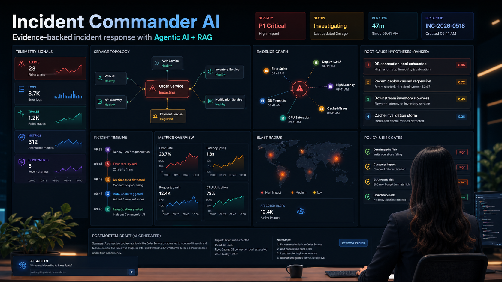

# 🚨 Incident Commander AI

**Evidence-backed incident response with Agentic AI + RAG**

> A multi-agent SRE assistant that ingests logs, traces, metrics, alerts, deployments, and runbooks — then reasons over them to investigate incidents, rank root causes, assess blast radius, and draft postmortems. All local-first, no live production system required.



---

## ✨ What It Does

When something breaks in production, every second counts. Incident Commander AI acts as your AI-powered on-call partner:

- 🔍 **Ingests** logs, traces, metrics, alerts, and deployment events
- 🧠 **Correlates** signals across your service topology using RAG
- 📊 **Ranks** root cause hypotheses with confidence scores
- 💥 **Maps** blast radius — which services and users are impacted
- 🛡️ **Enforces** policy gates before recommending risky actions
- 📝 **Drafts** postmortems automatically with timeline, impact, and next steps
- 🤖 **AI Copilot** chat for free-form investigation queries

---

## 🏗️ Architecture

```
┌─────────────────────────────────────────────────────┐
│                  React Dashboard                     │
│  Telemetry · Timeline · Topology · Evidence Graph   │
└──────────────────────┬──────────────────────────────┘
                       │ REST / WebSocket
┌──────────────────────▼──────────────────────────────┐
│               FastAPI Backend (port 8100)            │
└──────────┬──────────────────┬───────────────────────┘
           │                  │
┌──────────▼──────┐  ┌────────▼──────────────────────┐
│   Agents Layer  │  │        Data Layer              │
│ • Ingestion     │  │  PostgreSQL  ·  Redis          │
│ • Correlation   │  │  (via Docker Compose)          │
│ • Hypothesis    │  └───────────────────────────────-┘
│ • Blast Radius  │
│ • Policy Gate   │
│ • Postmortem    │
│ • Memory / RAG  │
└─────────────────┘
```

---

## 📦 What's Included

| Component | Description |
|-----------|-------------|
| `apps/api` | FastAPI backend |
| `apps/web` | React engineering console |
| `agents/` | Ingestion, correlation, hypothesis ranking, blast radius, policy, actions, postmortem, memory |
| `examples/incidents/` | Synthetic scenarios: checkout latency, Kafka lag, auth errors, cascading failures, feature flag rollout |
| `libs/` | Shared utilities and RAG library |
| `infra/` | Docker Compose for API + web + PostgreSQL + Redis |
| `tests/` | Unit and integration test suite |

---

## 🚀 Quick Start

### Option 1 — Local Python (Recommended for Development)

**Prerequisites:** Python 3.10+, Node.js 18+

```bash
# 1. Clone the repo
git clone https://github.com/ShivangiRay/Incident-Commander-AI.git
cd Incident-Commander-AI

# 2. Create and activate virtual environment
python -m venv .venv
source .venv/bin/activate        # Windows: .venv\Scripts\activate

# 3. Install dependencies
pip install -e ".[dev]"

# 4. Run the test suite to verify everything works
pytest

# 5. Run a synthetic incident demo
python -m libs.common.demo examples/incidents/checkout-latency.json build/incident

# 6. Start the API server
uvicorn apps.api.main:app --reload --port 8100
```

Then start the dashboard in a **new terminal**:

```bash
cd apps/web
npm install
npm run dev
```

Open [http://localhost:5173](http://localhost:5173) and log in with:

| Field | Value |
|-------|-------|
| Email | `sre@example.com` |
| Password | `demo-password` |

---

### Option 2 — Docker Compose (Easiest)

**Prerequisites:** Docker Desktop

```bash
# Clone and start everything in one command
git clone https://github.com/ShivangiRay/Incident-Commander-AI.git
cd Incident-Commander-AI

docker compose -f infra/docker-compose.yml up --build
```

This spins up:
- **API** on `http://localhost:8100`
- **Web dashboard** on `http://localhost:5173`
- **PostgreSQL** on port 5432
- **Redis** on port 6379

Same demo login applies: `sre@example.com` / `demo-password`

---

## 🧪 How to Test It

### Run the Full Test Suite

```bash
# Activate venv first
source .venv/bin/activate

# Run all tests
pytest

# Run with verbose output
pytest -v

# Run a specific test file
pytest tests/test_agents.py -v
```

### Try the Synthetic Incident Scenarios

The repo ships with 5 pre-built incident scenarios. Run any of them:

```bash
# Checkout latency (the showcase scenario)
python -m libs.common.demo examples/incidents/checkout-latency.json build/incident

# Kafka lag
python -m libs.common.demo examples/incidents/kafka-lag.json build/incident

# Auth errors
python -m libs.common.demo examples/incidents/auth-errors.json build/incident
```

Each run writes reasoning artifacts, evidence graphs, and postmortem drafts to `build/incident/`.

### Explore the Dashboard

Once running, try these things in the UI:

1. **Telemetry Signals** — See live alerts, logs, traces, and metrics
2. **Service Topology** — Visual graph showing which services are impacted
3. **Evidence Graph** — Timeline of correlated events with confidence links
4. **Root Cause Hypotheses** — Ranked list with confidence scores (0–1)
5. **Blast Radius** — World map of impacted regions and affected user count
6. **Policy & Risk Gates** — See what guardrails fire before actions are taken
7. **AI Copilot** — Type a question like *"Why is the order service failing?"*
8. **Postmortem Draft** — AI-generated draft ready to review and publish

---

## 🤖 Agent Overview

| Agent | Role |
|-------|------|
| **Ingestion Agent** | Parses and normalizes logs, traces, metrics, alerts, deployments |
| **Correlation Agent** | Links signals across services using time windows and dependency graphs |
| **Hypothesis Agent** | Ranks root causes using Bayesian-style scoring |
| **Blast Radius Agent** | Determines downstream service and user impact |
| **Policy Agent** | Enforces approval gates for high-risk recommendations |
| **Action Agent** | Suggests remediation steps gated by policy |
| **Postmortem Agent** | Generates structured postmortem draft from incident timeline |
| **Memory Agent** | RAG over past incidents and runbooks for institutional memory |

---

## 📋 Incident Scenarios Included

| Scenario | Description |
|----------|-------------|
| `checkout-latency.json` | DB connection pool exhaustion causing order service degradation |
| `kafka-lag.json` | Consumer lag causing event processing delays |
| `auth-errors.json` | Authentication service failures after config change |
| `cascading-dependency.json` | Cascading failure across dependent microservices |
| `feature-flag-rollout.json` | Bad feature flag rollout causing elevated error rates |

---

## 🛠️ Tech Stack

- **Backend:** Python, FastAPI, SQLAlchemy, PostgreSQL, Redis
- **Frontend:** React, Vite, CSS
- **AI/ML:** Agentic AI, RAG (retrieval-augmented generation)
- **Infra:** Docker Compose
- **Testing:** pytest

---

## 📁 Project Structure

```
Incident-Commander-AI/
├── agents/          # All AI agents (ingestion, correlation, etc.)
├── apps/
│   ├── api/         # FastAPI backend (main.py entry point)
│   └── web/         # React frontend dashboard
├── docs/            # Documentation and assets
├── examples/
│   └── incidents/   # Synthetic incident JSON scenarios
├── infra/           # Docker Compose and infra configs
├── libs/            # Shared libraries (common, RAG, etc.)
├── tests/           # Test suite
├── pyproject.toml   # Python project config + dependencies
└── README.md
```

---

## 🤝 Contributing

PRs and issues welcome! If you build a new synthetic incident scenario or add a new agent, please open a PR.

---

## 📄 License

MIT

---

*Built with ❤️ for SREs who are tired of 3 AM war rooms.*
